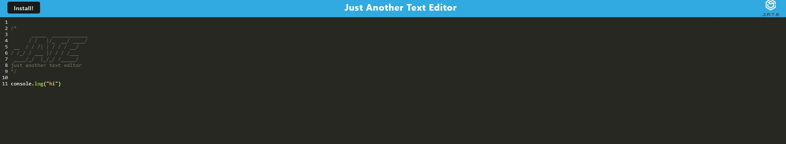
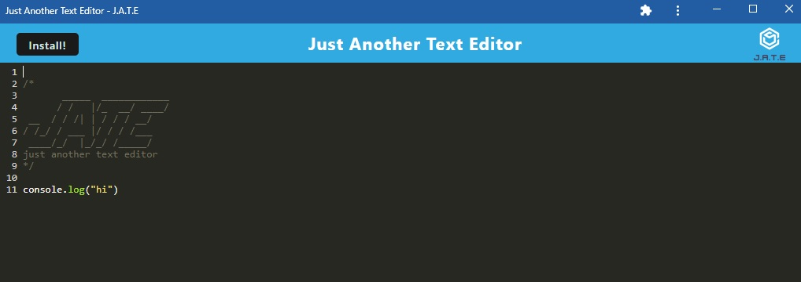

# The Best Text Editor

## Description
I made the Best Text Editor(A.K.A = Just Another Text Editor).

This code was written along with my class. All credit goes to my class!

This application can be used to edit texts, and users can access their texts at a later time on- or offline. The application is also install-able.

Enjoy!

GitHub Repository: [https://github.com/jhur628/the-best-text-editor](https://github.com/jhur628/the-best-text-editor)

Deployed Application: [https://warm-tundra-56360.herokuapp.com/](https://warm-tundra-56360.herokuapp.com/)

## Table of Contents
1. [Installation](#Installation)
2. [Usage](#Usage)
3. [Credits](#Credits)
4. [Questions](#Questions)
5. [Screenshots](#Screenshots)
6. [License](#License)

## Installation
No installation required. The application is deployed on Heroku.

## Usage
Users are able to write texts to view later. Users are also able to install the text editor to use offline. 

## Credits
As aforementioned, this application was coded along with the whole class. A big thank you to our TA, Pat. Thanks, Pat. Credit also to Jen(our other TA) and our instructor, Lori.

## Questions
Have any questions?  
Contact me at hur.john628.com.  
Github: https://github.com/jhur628/  

## Screenshots

## License
MIT   For more information on the MIT license, visit: https://opensource.org/licenses/MIT